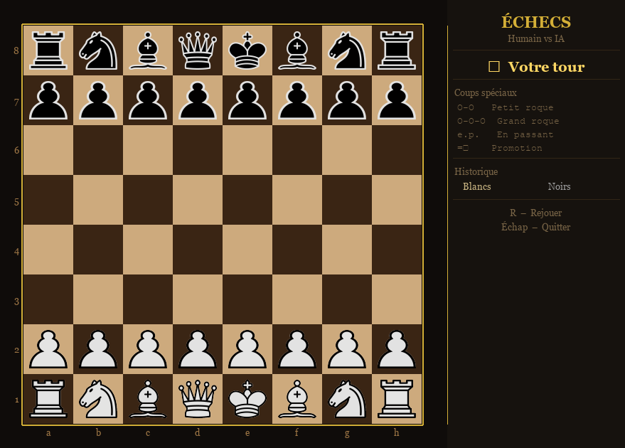

# <p align="center">♟️ Jeu d'Échecs — Python / Pygame</p>

Jeu d'échecs graphique en Python avec interface pygame, intelligence artificielle et gestion complète des règles officielles.
<p align="center">
  
</p>


## Prérequis

- Python 3.10 ou supérieur (requis pour la syntaxe `match/case`)
- pygame

```bash
pip install pygame
```


## Lancement

```bash
python chess.py
```

Un menu s'affiche au démarrage. Choisissez votre mode de jeu :

| Mode | Description |
|---|---|
| **Humain vs IA** | Vous jouez les Blancs, l'IA joue les Noirs |
| **2 Joueurs** | Deux joueurs s'affrontent sur le même écran |


## Comment jouer

1. **Sélectionner une pièce** — cliquez sur l'une de vos pièces. Les cases accessibles s'affichent en surbrillance.
2. **Déplacer** — cliquez sur une case mise en évidence pour y déposer la pièce.
3. **Promotion** — quand un pion atteint la dernière rangée, un popup apparaît pour choisir la pièce de promotion (Dame, Tour, Cavalier, Fou).

### Raccourcis clavier

| Touche | Action |
|---|---|
| `R` | Recommencer la partie (même mode) |
| `Échap` | Retourner au menu principal |


## Coups spéciaux pris en charge

- **Roque petit** (O-O) et **roque grand** (O-O-O) — le roi glisse de deux cases vers la tour correspondante.
- **Prise en passant** — capture diagonale d'un pion qui vient d'avancer de deux cases.
- **Promotion de pion** — choix interactif parmi Dame, Tour, Cavalier ou Fou.


## Images des pièces (optionnel)

Le jeu affiche les pièces en symboles Unicode par défaut. Pour utiliser des images personnalisées, créez un dossier `images/` à côté du script et placez-y des fichiers nommés selon ce format :

```
blanc_roi.png    blanc_reine.png    blanc_tour.png
blanc_fou.png    blanc_cavalier.png blanc_pion.png
noir_roi.png     noir_reine.png     noir_tour.png
noir_fou.png     noir_cavalier.png  noir_pion.png
```

Formats acceptés : `.png`, `.jpg`, `.jpeg`


## Architecture du code

Le fichier est organisé en couches bien séparées :

```
chess.py
├── Constantes & enums        (Color, PieceType, GameMode, valeurs, PST, couleurs UI)
├── Engine                    Moteur pur sans état : génération et validation des coups
├── Notation                  Notation algébrique standard
├── AIPlayer                  Intelligence artificielle
├── GameState                 État complet d'une partie
├── PromotionPopup            Fenêtre de choix de promotion
├── Renderer                  Rendu graphique pygame
├── MenuScreen                Écran de sélection du mode
└── App                       Boucle principale de l'application
```


## Ce que l'on apprend en lisant ce projet

### 1. Architecture orientée objet en Python
Chaque responsabilité est isolée dans sa propre classe. `Engine` ne connaît pas `GameState`, `Renderer` ne connaît pas `AIPlayer`. C'est le principe de **séparation des préoccupations** appliqué concrètement.

### 2. Algorithme Minimax avec élagage Alpha-Bêta
L'IA (`AIPlayer`) explore l'arbre des coups possibles jusqu'à une profondeur configurable (`AI_DEPTH = 3`). L'**élagage alpha-bêta** coupe les branches inutiles, réduisant drastiquement le nombre de positions évaluées sans changer le résultat.

### 3. Table de transposition
L'IA mémorise les positions déjà calculées dans un dictionnaire (`_transposition_table`). Si la même position est atteinte par un chemin différent, le résultat est réutilisé sans recalcul — c'est une forme de **mémoïsation** appliquée aux jeux de plateau.

### 4. Fonction d'évaluation heuristique
Chaque position est notée par `_evaluate()` en combinant la valeur matérielle des pièces et des **tables de positionnement** (Piece-Square Tables / PST) qui encouragent l'IA à occuper le centre, à développer ses pièces et à sécuriser son roi.

### 5. Tri des coups (MVV-LVA)
Avant d'explorer les coups, l'IA les trie par priorité (`_move_priority`) en favorisant les captures de pièces de haute valeur par des pièces de faible valeur (**Most Valuable Victim – Least Valuable Attacker**). Cela améliore l'efficacité de l'élagage alpha-bêta.

### 6. Génération et validation de coups légaux
`Engine` sépare les **pseudo-coups** (mouvements géométriques bruts) des **coups légaux** (qui ne laissent pas le roi en échec). La vérification d'échec se fait par simulation : on applique le coup sur une copie du plateau et on teste si le roi est attaqué.

### 7. Multithreading
Le calcul de l'IA s'exécute dans un **thread séparé** (`threading.Thread`) pour ne pas bloquer l'interface graphique pendant la réflexion. Un indicateur visuel animé ("L'IA réfléchit…") s'affiche pendant ce temps.

### 8. Dataclass Python
`GameState` utilise le décorateur `@dataclass` pour déclarer l'état de la partie de façon concise, avec valeurs par défaut et factory functions (`field(default_factory=...)`).

### 9. Enums typés
`Color`, `PieceType` et `GameMode` sont définis avec `enum.Enum`. Cela évite les chaînes magiques dispersées dans le code et rend les comparaisons sûres et lisibles.

### 10. Rendu graphique avec pygame
La classe `Renderer` gère l'intégralité de l'affichage : plateau, coordonnées, surbrillances, historique des coups, panneau d'information, popups. On y apprend les bases du rendu 2D avec pygame (surfaces, polices, `blit`, `draw`).


## Paramètres à modifier facilement

| Constante | Rôle | Valeur par défaut |
|---|---|---|
| `AI_DEPTH` | Profondeur de recherche de l'IA | `3` |
| `BOARD_SIZE` | Taille du plateau en pixels | `560` |
| `PIECE_SCALE` | Taille des pièces (fraction de la case) | `0.78` |
| `PANEL_W` | Largeur du panneau latéral | `260` |


## Limitations connues

- Pas de détection du pat par répétition triple ni de la règle des 50 coups.
- L'IA joue toujours les Noirs en mode Humain vs IA.
- Pas de sauvegarde de partie ni d'export PGN.
